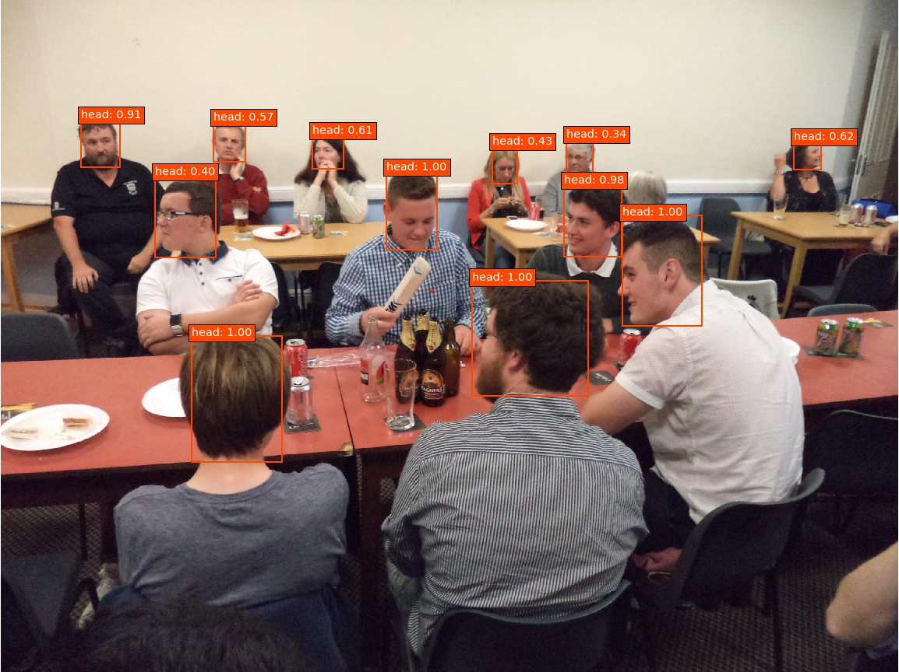

# Mask Detection

These are examples of using the **TrackEverything** package, you can find instructions on installation and other explanations [here](https://github.com/ami-a/TrackEverything). These Mask Detection examples are open-sourced framework built on top of the **TrackEverything** package and uses detection models, classification models, tracking algorithms and statistics-based decision making. The project allows you to detected people with or without masks, I used several models from different repositories or packages and combined them.

## Overview

You can find all the models and test videos [here](https://drive.google.com/drive/folders/19jsLpv8Ql_ebqYZy1vnC3Snp0dNQ8HX0?usp=sharing).

### Mask Example 1

#### The Detection Model

This example uses an Head Detection model from [AVAuco/ssd_head_keras github repository](https://github.com/AVAuco/ssd_head_keras) for detecting heads, I modified the files to be compatible with TF2.2. The model has been trained using the [Hollywood Heads dataset](https://www.robots.ox.ac.uk/~vgg/software/headmview/) as positive samples, and a subsample of the [EgoHands dataset](http://vision.soic.indiana.edu/projects/egohands/) as negative
samples. This model has been developed using [Pierluigi Ferarri's Keras implementation of SSD](https://github.com/pierluigiferrari/ssd_keras/) as primary source, and replicates the original [Matconvnet version of our model](https://github.com/AVAuco/ssd_people). In the `custom_get_detection_array` I used the model to give me all the heads detected in a frame with a score of at least `detection_threshold=0.12`. Later I filter out redundant overlapping detections using the default Non-maximum Suppression (NMS) method. 

### The Classification Model

After we have the heads from the detection model, I put them through a classification model to determine the probability of them being with a mask. I used the Face Mask classification model from [chandrikadeb7/Face-Mask-Detection github repository](https://github.com/chandrikadeb7/Face-Mask-Detection). It's based on the MobileNetV2 architecture, it’s also computationally efficient and thus making it easier to deploy the model to embedded systems (Raspberry Pi, Google Coral, etc.). 

## Results

I only tested it on one video I found online but the results are fair and setting could be optimized much more. The head detection is very rudimentary and has a lot of misses and partial matches.

### Mask Example 2
#### The Detection Model

This example uses an Head Detection model from [AVAuco/ssd_head_keras github repository](https://github.com/AVAuco/ssd_head_keras) for detecting heads, I modified the files to be compatible with TF2.2. The model has been trained using the [Hollywood Heads dataset](https://www.robots.ox.ac.uk/~vgg/software/headmview/) as positive samples, and a subsample of the [EgoHands dataset](http://vision.soic.indiana.edu/projects/egohands/) as negative
samples. This model has been developed using [Pierluigi Ferarri's Keras implementation of SSD](https://github.com/pierluigiferrari/ssd_keras/) as primary source, and replicates the original [Matconvnet version of our model](https://github.com/AVAuco/ssd_people). In the `custom_get_detection_array` I used the model to give me all the heads detected in a frame with a score of at least `detection_threshold=0.12`. Later I filter out redundant overlapping detections using the default Non-maximum Suppression (NMS) method. 

### The Classification Model

After we have the heads from the detection model, I put them through a classification model to determine the probability of them being with a mask. I used the Face Mask classification model from [chandrikadeb7/Face-Mask-Detection github repository](https://github.com/chandrikadeb7/Face-Mask-Detection). It's based on the MobileNetV2 architecture, it’s also computationally efficient and thus making it easier to deploy the model to embedded systems (Raspberry Pi, Google Coral, etc.). 

## Results

I only tested it on one video I found online but the results are fair and setting could be optimized much more. The head detection is very rudimentary and has a lot of misses and partial matches.

